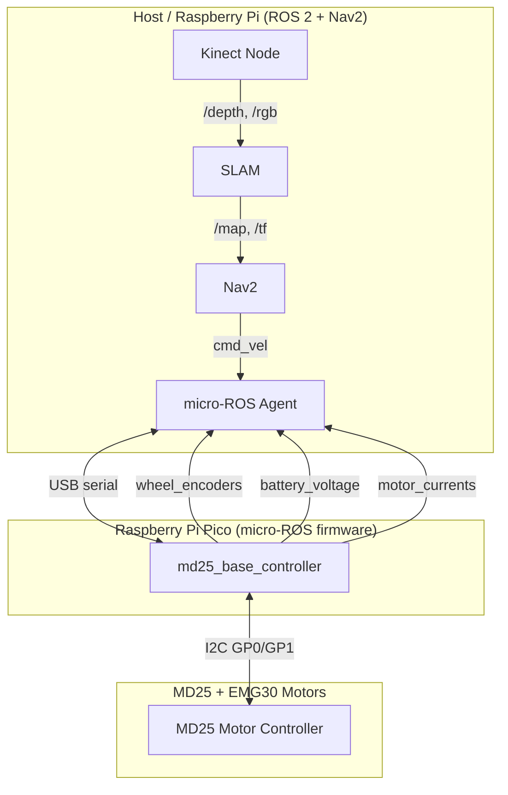

# ROS 2 Autonomous TurtleBot

Autonomous navigation robot using ROS 2 Nav2 stack with SLAM. Built around an MD25 dual motor controller, Raspberry Pi Pico (micro-ROS firmware), and a Kinect 360 for perception.

## Architecture



## Repository Structure

```
firmware/          Pico micro-ROS firmware (C, Pico SDK)
  src/main.c       micro-ROS node with cmd_vel, encoders, diagnostics
  src/md25.c/.h    MD25 I2C driver
  CMakeLists.txt   Build configuration
  README.md        Firmware quickstart guide
```

## Quick Start

See [firmware/README.md](firmware/README.md) for build and flash instructions.
