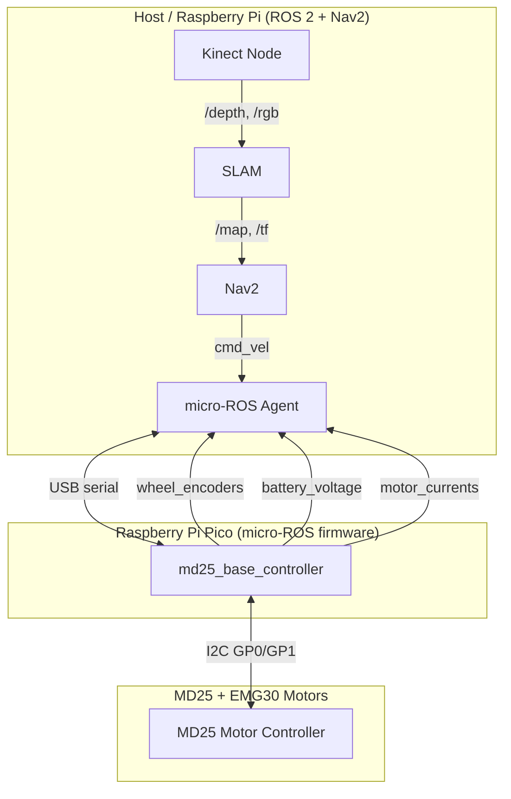

# ROS 2 Autonomous TurtleBot

Autonomous navigation robot using ROS 2 Nav2 stack with SLAM. Built around an MD25 dual motor controller, Raspberry Pi Pico (micro-ROS firmware), and a Kinect 360 for perception.

## Architecture



## Repository Structure

```
firmware/                 Pico micro-ROS firmware (C, Pico SDK)
  src/main.c              micro-ROS node with cmd_vel, encoders, diagnostics
  src/md25.c/.h           MD25 I2C driver

turtlebot_description/    URDF model, RViz configs (ament_cmake)
  urdf/                   Xacro robot description
  launch/                 display.launch.py — standalone URDF viewer
  rviz/                   RViz display configs

turtlebot_bringup/        Hardware bringup nodes (ament_python)
  encoder_to_joint_states — encoder ticks → JointState
  diff_drive_odom         — encoder ticks → Odometry + odom→base_link TF
  launch/                 bringup.launch.py — robot_state_publisher + encoders + RViz

turtlebot_slam/           SLAM mapping (ament_cmake, config-only)
  launch/                 slam_mapping.launch.py — full SLAM pipeline with teleop
                          save_map.launch.py — save map to ~/maps/
  config/                 slam_toolbox_params.yaml, depthimage_to_laserscan.yaml
  maps/                   Saved map files (.pgm + .yaml)

turtlebot_navigation/     Nav2 autonomous navigation (ament_cmake, config-only)
  launch/                 navigation.launch.py — navigate with pre-built map
                          slam_navigation.launch.py — navigate while mapping
  config/                 nav2_params.yaml (AMCL, costmaps, planner, controller)
```

## Quick Start

### Build firmware
See [firmware/README.md](firmware/README.md) for build and flash instructions.

### Map a room
```bash
# Terminal 1: Start SLAM
ros2 launch turtlebot_slam slam_mapping.launch.py

# Terminal 2: Drive the robot
ros2 run teleop_twist_keyboard teleop_twist_keyboard

# Terminal 3: Save the map when done
ros2 launch turtlebot_slam save_map.launch.py map_name:=my_room
```

### Autonomous navigation
```bash
# With a saved map:
ros2 launch turtlebot_navigation navigation.launch.py map:=~/maps/my_room.yaml

# Or with live SLAM (no map needed):
ros2 launch turtlebot_navigation slam_navigation.launch.py
```

Then click **Nav2 Goal** in RViz to send the robot to a target pose.
