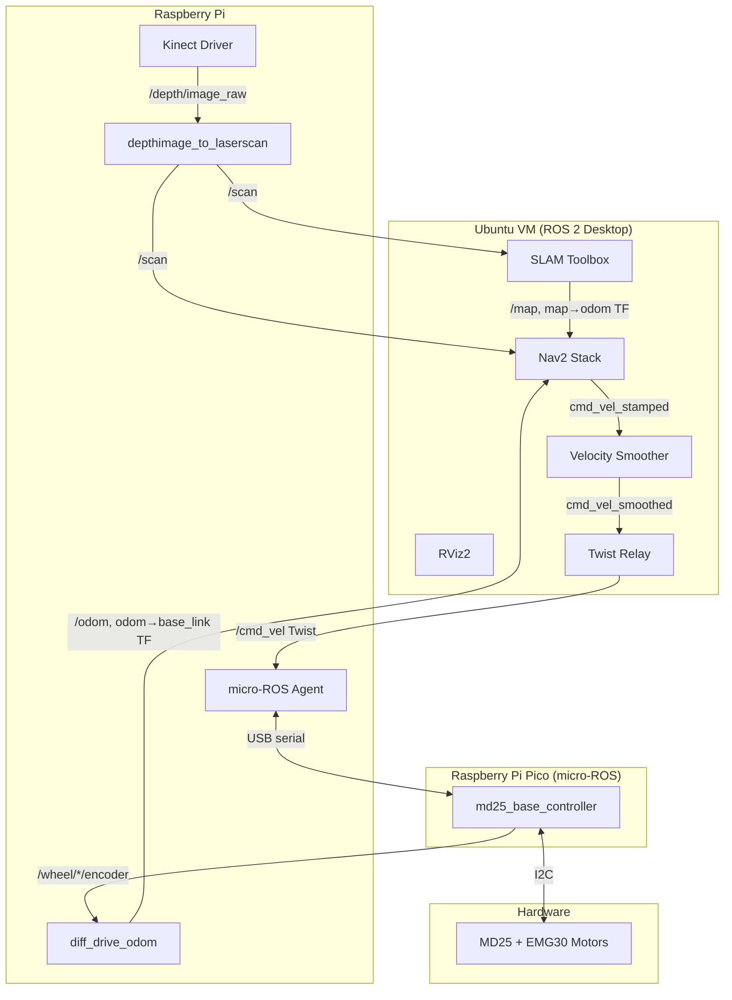

# ROS 2 Autonomous TurtleBot

Autonomous navigation robot built with ROS 2 Kilted and the Nav2 stack. Uses a Kinect 360 for depth perception, an MD25 motor controller with EMG30 motors, and a Raspberry Pi Pico running micro-ROS firmware.

The robot can map rooms using SLAM and navigate autonomously to goals while avoiding obstacles.

## Architecture



**Key detail:** Nav2 Kilted publishes `TwistStamped` by default. The micro-ROS firmware expects plain `Twist`. A relay node (`twist_relay`) bridges this gap. See [turtlebot_navigation/README.md](turtlebot_navigation/README.md) for details.

## Hardware

| Component | Role |
|-----------|------|
| Raspberry Pi 4 | Kinect driver, micro-ROS agent, depth→laserscan, odometry |
| Raspberry Pi Pico | micro-ROS firmware: cmd_vel → motors, encoder/battery publishing |
| MD25 motor controller | I2C dual motor driver (Mode 0: individual speed control) |
| EMG30 motors (×2) | Differential drive, 360 ticks/rev encoders |
| Kinect 360 | Depth camera (0.45–4.0m range) |
| Ubuntu VM (on Mac) | RViz, Nav2, SLAM, development |

## Repository Structure

```
firmware/                   Pico micro-ROS firmware (C, Pico SDK)
  src/main.c                cmd_vel subscriber, encoder/battery publishers, watchdog
  src/md25.c/.h             MD25 I2C driver

turtlebot_description/      URDF robot model (ament_cmake)
  urdf/turtlebot.urdf.xacro Robot description (base, wheels, kinect, caster)
  launch/display.launch.py  Standalone URDF viewer in RViz

turtlebot_bringup/          Hardware interface nodes (ament_python)
  encoder_to_joint_states   Encoder ticks → JointState for URDF visualization
  diff_drive_odom           Encoder ticks → Odometry + odom→base_link TF
  twist_relay               TwistStamped → Twist converter (Nav2 Kilted compat)

turtlebot_slam/             SLAM mapping (ament_cmake, config-only)
  launch/slam_mapping.launch.py   Full SLAM pipeline with teleop
  config/                          slam_toolbox + depthimage_to_laserscan params

turtlebot_navigation/       Nav2 autonomous navigation (ament_cmake, config-only)
  launch/navigation.launch.py      Navigate with pre-built map (AMCL)
  launch/slam_navigation.launch.py Navigate while mapping (SLAM)
  config/nav2_params.yaml          All Nav2 tuning (controller, planner, costmaps)
```

## Setup

### Prerequisites

- Apple Silicon Mac with [UTM](https://mac.getutm.app) running Ubuntu 24.04 ARM64
- Raspberry Pi on the same network as the VM (bridged networking)
- CycloneDDS configured for unicast discovery on both machines

See [vm_and_cyclonedds_setup.md](vm_and_cyclonedds_setup.md) for full VM + networking setup.

### Install ROS 2 packages (on Ubuntu VM)

```bash
sudo apt install -y ros-kilted-navigation2 ros-kilted-nav2-bringup \
  ros-kilted-slam-toolbox ros-kilted-depthimage-to-laserscan \
  ros-kilted-rmw-cyclonedds-cpp
```

### Pull and rebuild

```bash
cd ~/ros2_ws/src/ros2-autonomous-turtle-robot
git pull

cd ~/ros2_ws
colcon build --symlink-install
source install/setup.bash
```

`firmware/COLCON_IGNORE` prevents colcon from trying to build the Pico firmware.

### Build and flash firmware

See [firmware/README.md](firmware/README.md).

## Quick Start

### Before every session

```bash
# Kill stale nodes from previous sessions
pkill -f "ros2 launch"

# Sync clocks (VMs drift — this is critical for TF)
date -u  # run on both machines, fix if they differ by more than 1-2s
```

### Map a room

```bash
# Terminal 1: Start SLAM
ros2 launch turtlebot_slam slam_mapping.launch.py

# Terminal 2: Activate slam_toolbox (lifecycle node)
ros2 lifecycle set /slam_toolbox configure
ros2 lifecycle set /slam_toolbox activate

# Terminal 3: Drive the robot around
ros2 run teleop_twist_keyboard teleop_twist_keyboard

# Terminal 4: Save the map when done
mkdir -p ~/maps
ros2 run nav2_map_server map_saver_cli -f ~/maps/my_room
```

### Navigate with SLAM (no pre-built map needed)

```bash
ros2 launch turtlebot_navigation slam_navigation.launch.py

# Activate slam_toolbox
ros2 lifecycle set /slam_toolbox configure
ros2 lifecycle set /slam_toolbox activate

# Use "Nav2 Goal" in RViz — click and drag to set position + heading
```

### Navigate with a saved map

```bash
ros2 launch turtlebot_navigation navigation.launch.py map:=$HOME/maps/my_room.yaml

# Set initial pose in RViz:
#   1. Click "2D Pose Estimate"
#   2. Click where the robot is on the map
#   3. Drag the arrow in the direction the robot is ACTUALLY facing
#
# Then use "Nav2 Goal" to send the robot somewhere
```

**Important:** The arrow direction when setting both the initial pose and the goal matters. The robot will rotate to match the goal heading on arrival.

## Troubleshooting

| Problem | Cause | Fix |
|---------|-------|-----|
| "frame does not exist" / costmap empty | Clocks out of sync between VM and Pi | `sudo timedatectl set-ntp true` on both, or manually sync with `sudo date -s "$(ssh pi@<IP> 'date')"` |
| Robot doesn't move, "Failed to make progress" | cmd_vel type mismatch (TwistStamped vs Twist) | Ensure `twist_relay` node is running: `ros2 node list \| grep twist` |
| Both Twist and TwistStamped on /cmd_vel | A Nav2 node publishing directly without remap | Check with `ros2 topic info /cmd_vel --verbose` — all Nav2 nodes should be remapped to `cmd_vel_stamped` |
| Initial pose keeps reverting | Auto-publish timer overwriting your manual pose | Removed in current version — set pose manually via RViz |
| Robot jitters / random movements | TwistStamped bytes interpreted as Twist | Type conflict on /cmd_vel — see row above |
| "Goal was rejected" | Costmaps not ready, TF chain incomplete | Set initial pose (map mode) or activate slam_toolbox (SLAM mode), wait a few seconds |
| Map not visible in RViz | QoS mismatch | In RViz Map display → Topic → set Durability to "Transient Local" |
| RViz black screen / crash (VM) | GPU passthrough issue | `export LIBGL_ALWAYS_SOFTWARE=1` before launching |

## Key Parameters

All Nav2 tuning is in `turtlebot_navigation/config/nav2_params.yaml`:

| Parameter | Value | Notes |
|-----------|-------|-------|
| max_vel_x | 0.3 m/s | EMG30 safe cruising speed |
| max_vel_theta | 0.8 rad/s | Smooth turning |
| robot_radius | 0.22 m | Slightly larger than physical for safety |
| inflation_radius | 0.55 m | Keeps robot away from walls |
| xy_goal_tolerance | 0.20 m | How close to the goal before stopping |
| yaw_goal_tolerance | 0.5 rad | How aligned with goal heading before stopping |
| laser range | 0.45–4.0 m | Kinect 360 usable depth range |

## Documentation

- [firmware/README.md](firmware/README.md) — Pico build, flash, wiring, calibration
- [turtlebot_navigation/README.md](turtlebot_navigation/README.md) — Nav2 architecture, topic flow, tuning
- [vm_and_cyclonedds_setup.md](vm_and_cyclonedds_setup.md) — VM creation, bridged networking, DDS config
